# 基于茶叶数据的知识图谱+RAG+本地大模型部署项目总结
## 项目介绍
以百科网站的茶叶数据为基础，使用Ollama本地部署大预言模型（***Large Language Model，LLM***），结合带有知识图谱（***Knowledge Graph，KG***）的检索增强生成（***Retrieval-Augmented Generation，RAG***）技术，如**GraphRAG**、**LightRAG**，以实现增强大模型在垂直领域的问答能力，减弱大模型因垂直领域知识缺乏带来的幻觉问题。


## 目录
- [涉及技术](#涉及技术)
    - [爬虫](#1-爬虫)
    - [知识图谱](#2-知识图谱)
    - [GraphRAG](#3-graphrag)
    - [LightRAG](#4-lightrag)
    - [Ollama本地部署大模型](#5-ollama本地部署大模型)
    - [RAG评分系统](#RAG评分系统)
- [代码解析](#代码解析)
  - [爬虫](#爬虫crawler)
  - [GraphRAG](#修改graphrag源码)
  - [LightRAG](#初始化rag系统)
- [运行RAG系统](#运行rag系统)
  - [运行GraphRAG](#运行graphrag)
  - [运行LightRAG](#运行lightrag)
- [项目文件解释](#项目文件解释)
- [TODO](#todo-list)
- [项目结构](#项目结构)


## 涉及技术
### 1. 爬虫
使用``DrissionPage``库（[官方网站][DrissionPage]，[github地址][DrissionPage_github]），从网络上爬取茶叶百科的页面，并提取出其中的信息。         
- 爬取页面的标题
- 爬取页面的介绍部分
- 爬取页面的结构化数据
- 爬取页面的非结构化数据
- 该页面是从哪个标题页面跳转过来的
- 该页面存在的图片路径与其对应的图标题
- 该页面的网址
- 该网页标题的词条（分类）

### 2. 知识图谱
转载微信公众号推文[《大厂技术实现 | 详解知识图谱的构建全流程》][Knowledge Graph]

### 3. GraphRAG
***详情参考微软[官方文档][GraphRAG]（[github文档][GraphRAG_github]）***  
GraphRAG的IIndexing大致流程如下：  
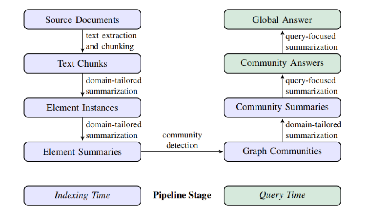
#### 阶段一：文本分块
将用户传入的文档按照``chunk_size``参数大小进行分块，作用于后续的知识提取，并且提取出的信息可以追溯到其原始的文本。
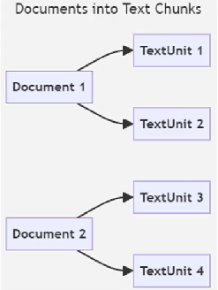
#### 阶段二：图形提取
使用LLM对分割出的文本块进行信息提取并生成摘要。
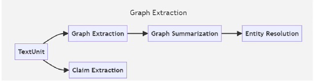
其中，提取的目标包括：**实体{entities}**、**关系{relationships}** 以及 ***声明{claims}（可选）***。  
提取出的实体和关系将形成两个列表，其中一个含有**实体名称**、**实体类型**、**实体描述（摘要）**；另一个则包含**头实体**、**尾实体**、**关系描述（摘要）**。  
其中的摘要信息同样是由大模型生成得到的，在此阶段我们可以说得到了一个包含实体与关系的图谱。
#### 阶段三：图形增强
使用***Leiden Hierarchical***算法进行社区检测，即生成实体社区的层次结构。用不严谨的话来说，就是将实体进行聚类，每一层则是一个社区。
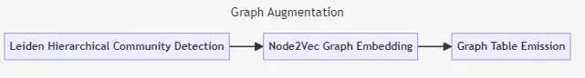
#### 阶段四：社区总结
使用LLM，根据上述步骤得到的社区数据，对每一个社区生成**社区报告**，同时对报告进行**摘要提取**。  

#### 阶段五：文档处理
将所有文档与第一阶段生成的文本块进行**链接**。  

#### 阶段六：向量化处理
将生成的实体、关系、社区等信息进行**向量化**处理。
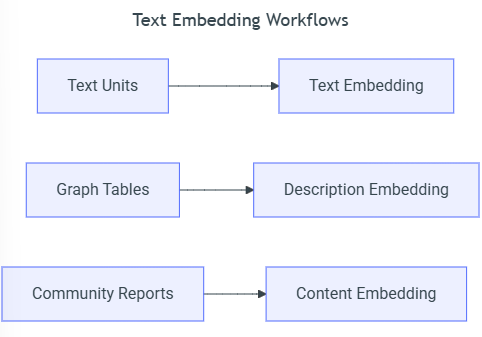

***上述信息均引用自[微软GraphRAG官方文档][GraphRAG]***  

### 4. LightRAG
***详情参考[官方文档][LightRAG_github]***  
LightRAG同样是一种将图谱与RAG作结合的技术。  
LightRAG由香港大学人员开发，采用双层检索系统，减轻了GraphRAG中基于社区的遍历相关的计算开销和缓慢、耗时的挑战。
#### Indexing
LightRAG的IIndexing大致流程如下：  
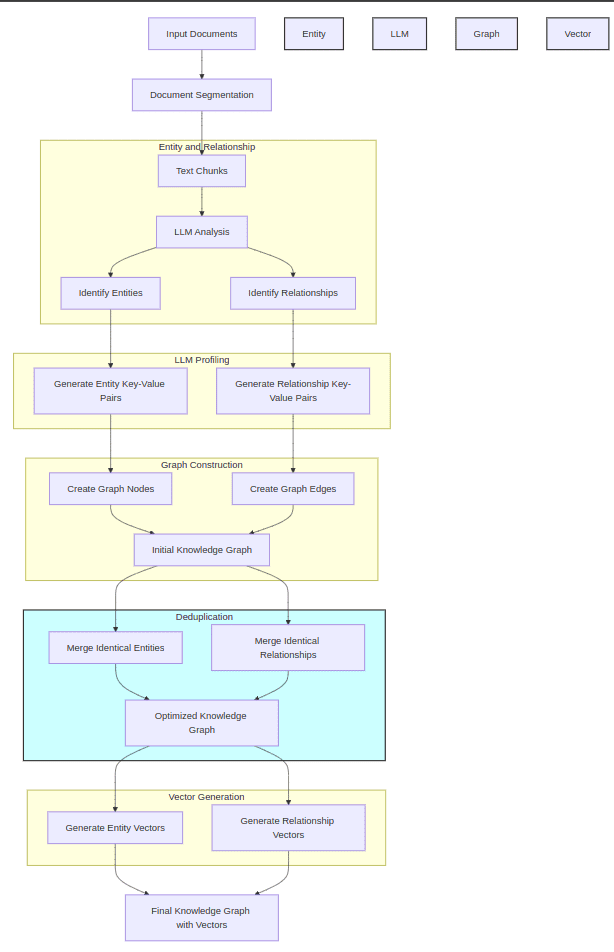
##### 阶段一：文本分块
与GraphRAG相同，同样是将传入的文本进行**分块**。
##### 阶段二：实体与关系提取
使用LLM，对文本块进行信息提取，将**实体**与**关系**提取出来。  
##### 阶段三：生成实体/关系键值对
在这阶段，LLM将对实体或关系进行分析，并生成总结性的文本段（可以说是摘要或描述），构建**实体/关系键值对**。  
其中， 键（Key）为实体或关系的名称，值为LLM生成的摘要。例子如下：  
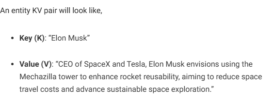
##### 阶段四：初始化图谱
根据得到的实体与关系，**构建图谱**的节点与关系，得到一个初始的图谱。
##### 阶段五：图谱去重
**优化图谱**，把重复的实体和关系合并，减少检索的开销与缩小图形的大小，得到最终优化后的图谱。
##### 阶段六：向量化
将数据进行**向量化**存储。
#### Retrieval and Query  
LightRAG的查询大致流程如下：  

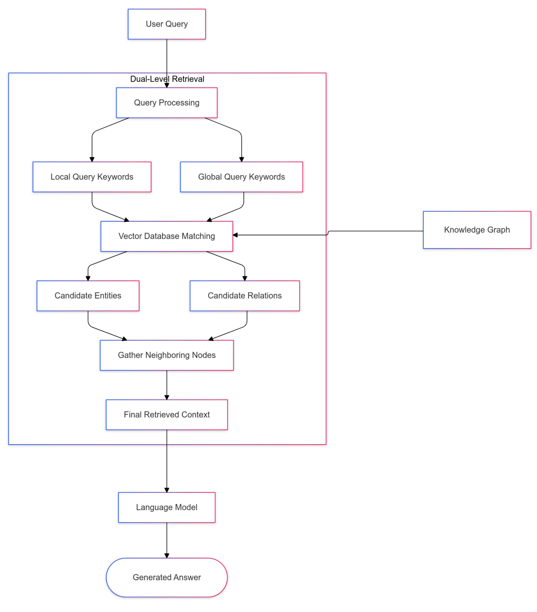

将用户的问题进行处理，得到对应的查询**关键词**，将关键词在向量数据库与知识图谱中进行**匹配**，得到最相关的**实体**或**关系**。接着获取**邻居节点**，最终获取到节点与关系对应的**文本块**，将检索到的信息提供给LLM，最终生成回答。  

***上述信息均引用自[LearnOpenCV][LightRAG_LearnOpenCV]与[LightRAG官方文档][LightRAG_github]***

### 5. Ollama本地部署大模型
[Ollama][Ollama_github]是一个能在本地机器上快速部署运行LLM的开源工具。  
#### 下载
前往[Ollama官网][Ollama]下载Ollama，快速部署本地大模型。  
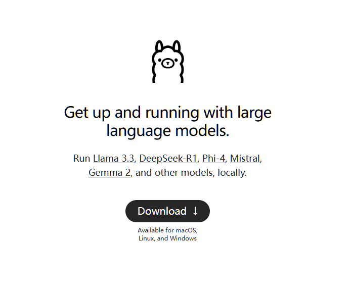
终端输入命令启动Ollama服务，服务默认端口号为11434。
```bash
ollama serve
```
#### 拉取模型
在Ollama官网搜索可拉取的模型 。
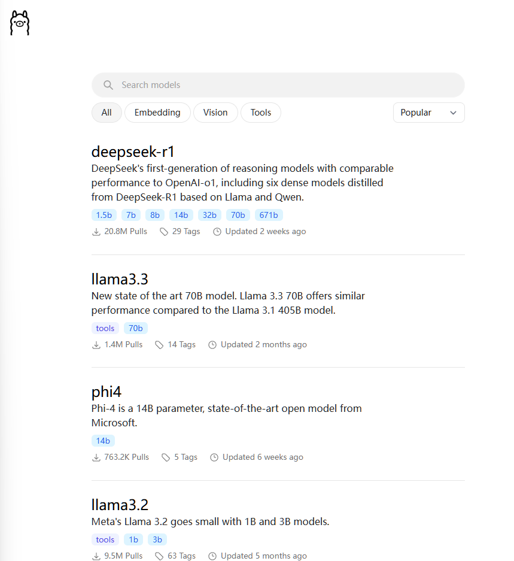
选取目标模型（以**deepseek-r1的32b**模型为例），在终端运行命令。
```bash
ollama pull deepseek-r1:32b
```
在模型文件下载完成后，在终端输入命令，查看已经拉取完成的模型列表。
```bash
ollama list
```
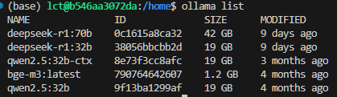
#### 运行模型
在终端输入命令，启动模型。
```bash
ollama run deepseek-r1:32b
```
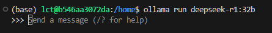
可以看到模型已经成功部署在显卡上。
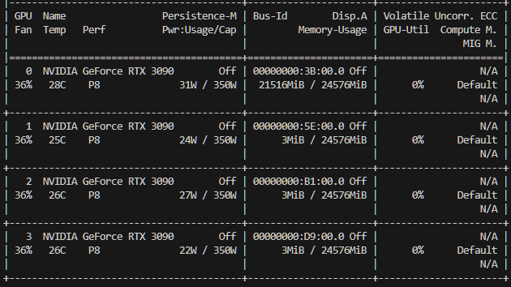
这时就已经可以与大模型进行交互了。

需要停止模型运行，则输入命令。
```bash
ollama stop deepseek-r1:32b
```

更多功能请输入命令或***前往[Ollama][Ollama_github]查看。***
```bash
ollama --help
```

### 6. RAG系统评分
可使用评分工具[ragas][ragas]和[RAGChecker][RAGChecker]对RAG系统进行多方面的评估。  
~~因为不可抗力原因，评分数据集迟迟构建不出来😢~~

## 代码解析
### 爬虫(Crawler)
#### spider_baidu_baike.py（核心）

该类用于爬取百科，在指定的路径下保存爬取结果。
```python
class spider_baike:
```
初始化可选择3个参数：
1. ``save_path``选择保存文件的路径（必须是json后缀）
2. ``visible``选择爬取结果是边爬边存还是全部爬完再存
3. ``edge_path``选择chrome内核浏览器的路径，默认为  
   "C:\\Program Files (x86)\\Microsoft\\Edge\\Application\\msedge.exe"（在获取图片路径时需用到浏览器）  

在创建完爬虫类后，调用类内函数``run()``即可开始爬取网页，而爬取网页可通过两种方式指定：  
1. 传入待爬取的百科词条列表``search_name``
2. 传入需爬取的百科网址``url``  

这两个参数选其一指定即可，若两者都填写，则以``url``为准。此外，``run()``仍可传入``max_depth``参数，用于指定爬取的深度，默认为0，即不进行页面跳转。  
若需要爬取条目为"绿茶"的百科网页以及该网页可以跳转的其他百科条目信息，即可指定参数如下：
```python
spider = spider_baike(save_path="your_path/file.json")
spider.run(search_name=["绿茶"], max_depth=1)
```

#### my_json2txt.py（可选）
该函数用于将爬取下来的json文件转化为指定格式txt文本。
```python
def json2txt(json_path, txt_path):
```
其中，``json_path``为json文件路径，``txt_path``为保存的txt文件路径。  
此外，函数支持指定``json_file``参数，用于存于**内存**中的DataFrame变量，而不是从硬盘中读取。当``json_path``与``json_file``同时指定时，``json_file``优先级更高。  
该函数还能指定转换的起始索引``start_idx``与终止索引``end_idx``，用于指定转换的范围。  

转换规则如下：
```txt
"标题"  ->  == "标题" ==
"词条"  ->  "标题"是"词条"
"介绍"  ->  -- "标题"的"介绍" -- \ "介绍内容"
"结构化数据"  ->  - "标题"的"Key":"Value"

"非结构化数据"  如下：
"h2"  ->  -- "标题"的"h2" -- \ "h2内容"
"h3"  ->  ~~ "h3" ~~ \ "h3内容"

"网址"  ->  -- "标题"的信息来源 -- \ 来源为百度百科，地址为"网址"

"未爬取到内容"  ->  "空行表示"
```
转换前后变化展示：  
[未转变的json文件](examples/data/unprocessed.json)  
[转变后的txt文本](examples/data/processed.txt)

### GraphRAG
#### 修改GraphRAG源码
因GraphRAG仅做了OpenAI接口，而Ollama的API调用与OpenAI调用语法略有不同（在Embedding模型调用时），故修改GraphRAG的代码以支持Ollama调用本地Embedding模型。[参考资料在这][CSDN_GraphRAG]。
##### 1. 修改graphrag/llm/openai/openai_embeddings_llm.py
在代码中找到
```python
embedding = await self.client.embeddings.create(
    input=input,
    **args,
)
return [d.embedding for d in embedding.data]
```
将其注释，修改为
```python
# 以下是增添的ollama embedding代码
embedding_list = []
for inp in input:
    embedding = ollama.embeddings(model="your_embedding_model_name",prompt=inp)
    embedding_list.append(embedding["embedding"])
return embedding_list

# 以下是原代码的embedding写法
# embedding = await self.client.embeddings.create(
#     input=input,
#     **args,
# )
# return [d.embedding for d in embedding.data]
```
##### 2. 修改graphrag/query/llm/oai/embedding.py
问题同样是Embedding的调用，可自行修改或直接用下方代码覆盖原文件代码。
```python
# 旧的embedding
# Copyright (c) 2024 Microsoft Corporation.
# Licensed under the MIT License

"""OpenAI Embedding model implementation."""

import asyncio
from collections.abc import Callable
from typing import Any

import numpy as np
import tiktoken
from tenacity import (
    AsyncRetrying,
    RetryError,
    Retrying,
    retry_if_exception_type,
    stop_after_attempt,
    wait_exponential_jitter,
)

from graphrag.query.llm.base import BaseTextEmbedding
from graphrag.query.llm.oai.base import OpenAILLMImpl
from graphrag.query.llm.oai.typing import (
    OPENAI_RETRY_ERROR_TYPES,
    OpenaiApiType,
)
from graphrag.query.llm.text_utils import chunk_text
from graphrag.logging import StatusLogger

from langchain_community.embeddings import OllamaEmbeddings


class OpenAIEmbedding(BaseTextEmbedding, OpenAILLMImpl):
    """Wrapper for OpenAI Embedding models."""

    def __init__(
        self,
        api_key: str | None = None,
        azure_ad_token_provider: Callable | None = None,
        model: str = "text-embedding-3-small",
        deployment_name: str | None = None,
        api_base: str | None = None,
        api_version: str | None = None,
        api_type: OpenaiApiType = OpenaiApiType.OpenAI,
        organization: str | None = None,
        encoding_name: str = "cl100k_base",
        max_tokens: int = 8191,
        max_retries: int = 10,
        request_timeout: float = 180.0,
        retry_error_types: tuple[type[BaseException]] = OPENAI_RETRY_ERROR_TYPES,  # type: ignore
        reporter: StatusLogger | None = None,
    ):
        OpenAILLMImpl.__init__(
            self=self,
            api_key=api_key,
            azure_ad_token_provider=azure_ad_token_provider,
            deployment_name=deployment_name,
            api_base=api_base,
            api_version=api_version,
            api_type=api_type,  # type: ignore
            organization=organization,
            max_retries=max_retries,
            request_timeout=request_timeout,
            reporter=reporter,
        )

        self.model = model
        self.encoding_name = encoding_name
        self.max_tokens = max_tokens
        self.token_encoder = tiktoken.get_encoding(self.encoding_name)
        self.retry_error_types = retry_error_types

    def embed(self, text: str, **kwargs: Any) -> list[float]:
        """
        Embed text using OpenAI Embedding's sync function.

        For text longer than max_tokens, chunk texts into max_tokens, embed each chunk, then combine using weighted average.
        Please refer to: https://github.com/openai/openai-cookbook/blob/main/examples/Embedding_long_inputs.ipynb
        """
        token_chunks = chunk_text(
            text=text, token_encoder=self.token_encoder, max_tokens=self.max_tokens
        )
        chunk_embeddings = []
        chunk_lens = []
        for chunk in token_chunks:
            try:
                embedding, chunk_len = self._embed_with_retry(chunk, **kwargs)
                chunk_embeddings.append(embedding)
                chunk_lens.append(chunk_len)
            # TODO: catch a more specific exception
            except Exception as e:  # noqa BLE001
                self._reporter.error(
                    message="Error embedding chunk",
                    details={self.__class__.__name__: str(e)},
                )

                continue
        chunk_embeddings = np.average(chunk_embeddings, axis=0, weights=chunk_lens)
        chunk_embeddings = chunk_embeddings / np.linalg.norm(chunk_embeddings)
        return chunk_embeddings.tolist()

    async def aembed(self, text: str, **kwargs: Any) -> list[float]:
        """
        Embed text using OpenAI Embedding's async function.

        For text longer than max_tokens, chunk texts into max_tokens, embed each chunk, then combine using weighted average.
        """
        token_chunks = chunk_text(
            text=text, token_encoder=self.token_encoder, max_tokens=self.max_tokens
        )
        chunk_embeddings = []
        chunk_lens = []
        embedding_results = await asyncio.gather(*[
            self._aembed_with_retry(chunk, **kwargs) for chunk in token_chunks
        ])
        embedding_results = [result for result in embedding_results if result[0]]
        chunk_embeddings = [result[0] for result in embedding_results]
        chunk_lens = [result[1] for result in embedding_results]
        chunk_embeddings = np.average(chunk_embeddings, axis=0, weights=chunk_lens)  # type: ignore
        chunk_embeddings = chunk_embeddings / np.linalg.norm(chunk_embeddings)
        return chunk_embeddings.tolist()

    def _embed_with_retry(
        self, text: str | tuple, **kwargs: Any
    ) -> tuple[list[float], int]:
        try:
            retryer = Retrying(
                stop=stop_after_attempt(self.max_retries),
                wait=wait_exponential_jitter(max=10),
                reraise=True,
                retry=retry_if_exception_type(self.retry_error_types),
            )
            for attempt in retryer:
                with attempt:
                    embedding = (
                        OllamaEmbeddings(
                            model=self.model,
                        ).embed_query(text)
                        or []
                    )
                    return (embedding, len(text))
        except RetryError as e:
            self._reporter.error(
                message="Error at embed_with_retry()",
                details={self.__class__.__name__: str(e)},
            )
            return ([], 0)
        else:
            # TODO: why not just throw in this case?
            return ([], 0)

    async def _aembed_with_retry(
        self, text: str | tuple, **kwargs: Any
    ) -> tuple[list[float], int]:
        try:
            retryer = AsyncRetrying(
                stop=stop_after_attempt(self.max_retries),
                wait=wait_exponential_jitter(max=10),
                reraise=True,
                retry=retry_if_exception_type(self.retry_error_types),
            )
            async for attempt in retryer:
                with attempt:
                    embedding = (
                        await OllamaEmbeddings(
                            model=self.model,
                        ).embed_query(text) or [] )
                    return (embedding, len(text))
        except RetryError as e:
            self._reporter.error(
                message="Error at embed_with_retry()",
                details={self.__class__.__name__: str(e)},
            )
            return ([], 0)
        else:
            # TODO: why not just throw in this case?
            return ([], 0)
```
#### 修改项目路径下的settings.yaml文件
以下是常用参数的修改说明：
```yaml
llm:
    api_key: ollama             # 这个填什么都可以，使用ollama调用本地大模型不需要api_key
    model: your_model_name      # 本地大模型的名称，必须修改！！
    max_tokens: 2000            # 最大token数量，可根据硬件配置调整
    request_timeout: 180        # 请求超时时间，可根据硬件配置调整
    api_base: http://localhost:11434/v1  # 调用ollama的LLM的地址，必须修改！！端口号按实际情况修改
    concurrent_requests: 8      # 并发请求数，可根据硬件配置调整

embeddings:
    llm:
        api_key: ollama         # 同样填什么都可以
        model: your_model_name  # 同样修改！！注意，需要修改源码处调用ollamaEmbedding的地方。
        api_base: http://localhost:11434/api  # 修改embedding的调用地址，必须修改！！。端口号按实际情况修改。

chunks:
    size: 600                   # 修改文本分块大小

storage:
    base_dir: "your_store_path"     # 修改存储路径，也可以通过运行命令时添加参数以实现同样的效果

update_index_storage:
    #base_dir: "your_store_path"    # 若启用该参数，GraphRAG将开启增量功能，增量后的数据将保存在该文件夹

reporting:
    base_dir: "your_log_path"   # 修改日志存储路径

entity_extraction:
    entity_types: [type1, type2, ···, type_n]  # 指定LLM提取实体的类型

summarize_descriptions:
    max_length: 800             # LLM生成摘要的最大长度

community_reports:
    max_length: 4000            # LLM生成社区报告的最大长度
    max_input_length: 10000     # 生成社区报告时的最大上下文长度
```

### LightRAG
LightRAG官方已经支持了使用ollama模型调用，故可以参考[LightRAG][LightRAG_github]官方文档的***Using Ollama Models***内容
#### 初始化RAG系统
采用官方的示例，并加以修改。
```python
import os
import logging
from lightrag import LightRAG, QueryParam
from lightrag.llm import ollama_model_complete, ollama_embedding
from lightrag.utils import EmbeddingFunc
from save_latest_output import save_backup 

WORKING_DIR = "your_working_dir"

logging.basicConfig(format="%(levelname)s:%(message)s", level=logging.INFO)

if not os.path.exists(WORKING_DIR):
    os.mkdir(WORKING_DIR)

rag = LightRAG(
    working_dir=WORKING_DIR,                # 指定RAG系统的工作目录
    llm_model_func=ollama_model_complete,   # 在使用ollama模型时，需要指定该参数
    llm_model_name="your_model_name",           # 指定ollama模型的名称
    llm_model_max_async=16,                 # 指定ollama模型的最大并发请求数
    llm_model_max_token_size=32768,         # 指定最大上下文
    chunk_token_size=600,                   # 指定文本分块大小
    entity_summary_to_max_tokens=800,       # 指定LLM生成摘要的最大长度

    # 该参数指定ollama服务地址，同时需要手动设置num_ctx参数以达到目标最大上下文长度（ollama会默认限制上下文长度为某个值）
    llm_model_kwargs={"host": "http://localhost:11434", "options": {"num_ctx": 32768}}, 

    # 该参数指定ollama模型的embedding函数，同时需要手动设置embed_model参数以调用ollama模型
    embedding_func=EmbeddingFunc(
        embedding_dim=1024,
        max_token_size=8192,
        func=lambda texts: ollama_embedding(
            texts, embed_model="your_model_name", host="http://localhost:11434"
        ),
    ),
)
```

## 运行RAG系统
### 运行GraphRAG
因本项目使用ollama部署本地大模型，要正常运行GraphRAG，需要按实际情况进行配置，可[参考上方内容](#修改graphrag源码)进行配置。
#### 1. 初始化项目文件
创建项目文件夹
```bash
mkdir TestGraphRAG
```
使用命令初始化项目文件夹
```bash
python -m graphrag init --root TestGraphRAG
```
此时会在TestGraphRAG文件夹下生成settings.yaml、.env、prompts文件，用于配置RAG系统的参数。  
（可选）GraphRAG可以按照用户需求自行调整提示词prompt，只需执行命令，详细信息请参考[官方文档][GraphRAG]。
```bash
python -m graphrag prompt-tune --root ~/GraphRAG [配置参数]
```
#### 2. 建立索引
在TestGraphRAG文件夹下创建input文件夹，用以存放原始语料。
```bash
cd TestGraphRAG
mkdir input
```
在放入输入数据并且配置好settings.yaml文件后，执行命令建立索引。
```bash
cd ..
python -m graphrag index --root TestGraphRAG
```
等待运行结束，成功建立索引。
（可选）GraphRAG支持增量更新，需要配置settings.yaml文件中的update_index_storage参数，并运行命令即可，详细信息请参考[官方文档][GraphRAG_github]。
```bash
python -m graphrag update --root_dir TestGraphRAG
```
#### 3. 执行查询
GraphRAG支持多种查询方式，详细信息请参考[官方文档][GraphRAG]，这里以全局搜索为例子。
```bash
python -m graphrag query --root TestGraphRAG --method global "your_query"
```

### 运行LightRAG
因本项目使用ollama部署本地大模型，故LightRAG的配置参数也需要往ollama的方向靠。
#### 1. 建立索引，生成图索引文件
新建一个python文件，参考[上方内容](#初始化RAG系统)配置LightRAG参数，初始化LightRAG对象。初始化后，调用LightRAG对象的``insert()``方法建立索引，参数为传入的文档数据，举个例子。
```python
with open("input/example.txt", "r", encoding="utf-8") as f:
    rag.insert(f.read())
```
（可选）LightRAG建立的索引可以在Neo4j上存储，进行可视化，详细信息请参考[官方文档][LightRAG_github]。要使用Neo4j存储，需要配置好Neo4j的参数。
```bash
export NEO4J_URI="neo4j://localhost:7687"
export NEO4J_USERNAME="your_username"
export NEO4J_PASSWORD="your_password"
```
同时，在初始化LightRAG对象时，设置参数``graph_storage="Neo4JStorage"``，即可实现将索引数据存储到Neo4j中。

#### 2. 执行查询
在初始化LightRAG对象后，调用对象的``query()``方法进行查询，参数传入查询语句与查询模板，查询模板可以调整查询返回的结果类型，详细信息请参考[官方文档][LightRAG_github]。查询模板的的参数如下。
```python
class QueryParam:
    mode: Literal["local", "global", "hybrid", "naive"] = "global"   # 以什么方式查询
    only_need_context: bool = False                                  # 是否只返回查询到的上下文
    response_type: str = "Multiple Paragraphs"                       # 规定生成相应的类型
    # Number of top-k items to retrieve; corresponds to entities in "local" mode and relationships in "global" mode.
    top_k: int = 60
    # Number of tokens for the original chunks.
    max_token_for_text_unit: int = 4000
    # Number of tokens for the relationship descriptions
    max_token_for_global_context: int = 4000
    # Number of tokens for the entity descriptions
    max_token_for_local_context: int = 4000
```
举个例子，我想以``global``的方式查询``"哪些品种被称为红茶？"``，并希望返回的结果类型为``"尽可能多的回答"``，并限制检索关系的数量为40个，则可以调用如下代码。
```python
rag.query("哪些品种被称为红茶？", param=QueryParam(mode="global", only_need_context=False, top_k=40, response_type='尽可能多的回答', max_token_for_global_context=32768))
```

## 项目文件解释
### GraphRAG项目文件
在GraphRAG项目文件夹下，output共有3次索引结果，first结果仅传入“**制茶技艺**”的文档，而second、third结果依次以增量的形式传入“**茶叶病害**”与“**茶叶害虫**”的文档。  
#### 遇到的问题
- 请求超时——单次LLM请求处理时间多次超过24min，巨大的时间资源消耗。
- Ollama上下文限制——GraphRAG使用OpenAI接口，没有内置的Ollama接口，参考GitHub社区的解决方法，依旧会有奇奇怪怪的报错。
- 运行不稳定——有时能顺利跑完整个流程，有时疯狂报错，从实体提取步骤开始就出错  
  
所以GraphRAG项目文件仅仅传入3个文档便止步了。

### LightRAG项目文件
在LightRAG项目文件夹下，output文件夹存储着最新生成的索引文件，同时Backup文件夹存储着历史索引文件。  
目前已传入超过600条条目文档数据。

### Ragas项目文件
在Ragas项目文件夹下，存放着尝试使用``ragas``库自动生成RAG评分数据集的notebook文件，以及生成出的测试数据。  


----------------------------------------------------------------
## TODO List:
- [ ] 构建用于评估RAG系统的数据集
- [ ] 构建用于用户交互的WebUI
----------------------------------------------------------------

[DrissionPage]: https://www.drissionpage.cn/
[DrissionPage_github]: https://github.com/g1879/DrissionPage
[Knowledge Graph]: https://mp.weixin.qq.com/s/7GkO5lX7ltXaMwH6tAN-RA
[GraphRAG_github]: https://github.com/microsoft/graphrag
[GraphRAG]: https://microsoft.github.io/graphrag/
[LightRAG_LearnOpenCV]: https://learnopencv.com/lightrag/
[LightRAG_github]: https://github.com/HKUDS/LightRAG
[Ollama]: https://ollama.com/
[Ollama_github]: https://github.com/ollama/ollama
[ragas]: https://github.com/explodinggradients/ragas
[RAGChecker]: https://github.com/amazon-science/RAGChecker
[CSDN_GraphRAG]: https://blog.csdn.net/gaotianhao123/article/details/140640415

## 项目结构
```txt
TeaInfo-KG-RAG-Ollama
├─assets
├─Crawler
├─examples
│  └─data
├─GraphRAG
│  ├─input
│  ├─output
│  │  ├─first
│  │  ├─lancedb
│  │  ├─second
│  │  └─third
│  └─prompts
├─LightRAG
│  ├─Backup
│  ├─input
│  ├─output
│  └─src
└─Ragas
    ├─src
    └─测试集参考文档
```